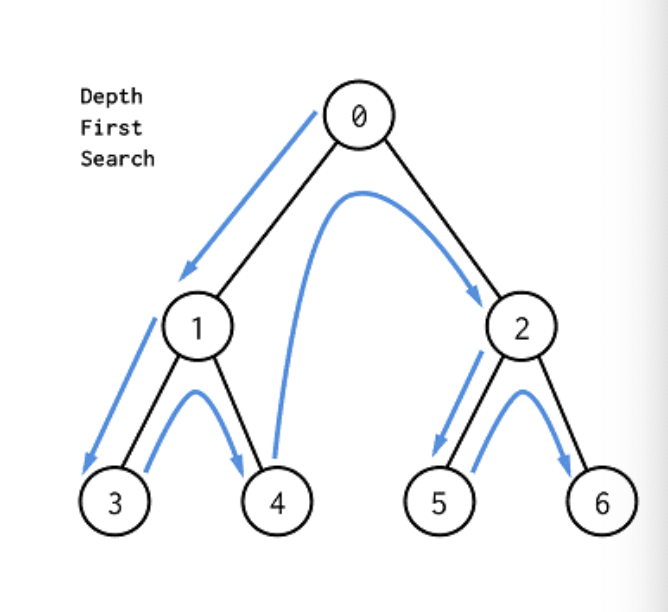
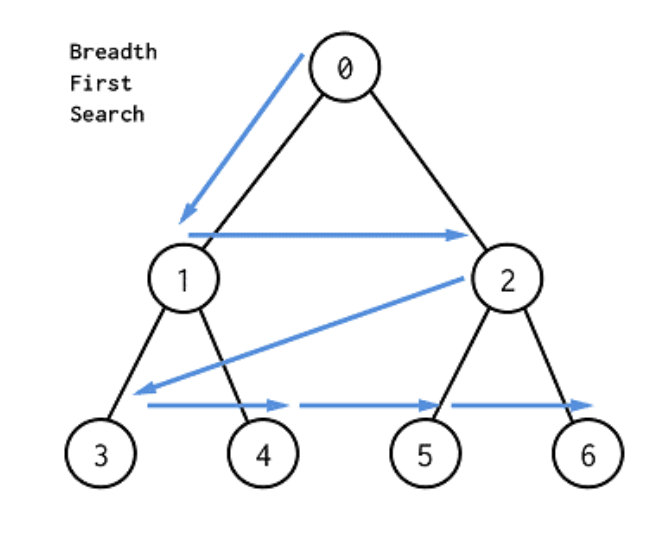
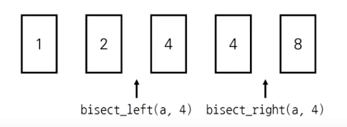
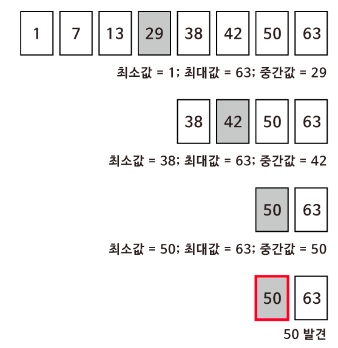

<h1 align="center">Searching algorithm</h1>
<p align="center">

- <u>**_수정_**</u>


<br>
<br>

## DFS(Depth-First Search)

- **깊이 우선 탐색**이라고도 부르며 그래프에서 깊은 부분을 우선적으로 탐색하는 알고리즘
- <U>스택</U> 자료구조(혹은 재귀 함수)를 이용
    1. 탐색 시작 노드를 스택에 삽입하고 방문 처리
    2. 스택의 최상단 노드에 방문하지 않은 인접한 노드가 하나라도 있으면 그 노드를 스택에 넣고 방문 처리, 방문 하지 않은 인접 노드가 없으면 스택에서 최상단 노드를 꺼냄
    3. 더 이상 2번의 과정을 수행할 수 없을 때까지 반복
    
<br>

- DFS 예시

</img>

```python
>>> graph = [[1,2],[0,3,4],[0,5,6],[1],[1],[2],[2]]
>>> start_node = 0
>>> visited = [False]*7
>>> dfs_iteration(graph, start_node, visited)
dfs_iteration =  [0, 2, 6, 5, 1, 4, 3]
```

<br>
<br>

## BFS(Breadth-First Search)

- **너비 우선 탐색**이라고도 부르며 그래프에서 가까운 노드부터 우선적으로 탐색하는 알고리즘
- <U>큐</U> 자료구조를 이용
    1. 탐색 시작 노드를 큐에 삽입하고 방문 처리
    2. 큐에서 노드를 꺼낸 뒤에 해당 노드의 인접 노드 중에서 방문하지 않은 노드를 모두 큐에 삽입하고 방문 처리
    3. 더 이상 2번의 과정을 수행할 수 없을 때까지 반복
- **<U>간선의 코스트를 부여하여 최단거리, 최소비용 문제에 출제 가능</U>**

<br>

- BFS 예시

</img>
```python
>>> graph = [[1,2],[0,3,4],[0,5,6],[1],[1],[2],[2]]
>>> start_node = 0
>>> visited = [False]*7
>>> bfs(graph, start_node, visited)
bfs = [0, 1, 2, 3, 4, 5, 6]
```

<br>
<br>

## 이진 탐색(Binary Search)

- 정렬되어 있는 리스트에서 **_탐색 범위를 절반씩 좁혀가며 데이터를 탐색_** 하는 방법
    - 이진 탐색은 시작점, 끝점, 중간점을 이용하여 탐색 범위를 설정
- 단계마다 탐색 범위를 2로 나누는 것과 동일하므로 연산횟수는 _log<sub>2</sub>N_ 에 비례
- 이진 탐색은 탐색범위를 절반씩 줄이며, 시간복잡도는 **_O(logN)_**

<br>

- 이진 탐색 라이브러리
    - bisect_left(a, x) : 정렬된 순서를 유지하면서 배열a에 x를 삽입할 가장 왼쪽 인덱스를 반환
    - bisect_right(a, x) : 정렬된 순서를 유지하면서 배열a에 x를 삽입할 가장 오른쪽 인덱스를 반환

</img>

```python
>>> from bisect import bisect_left, bisect_right
>>> a = [1,2,4,4,8]
>>> x = 4
>>> print(bisect_left(a,x))
2
>>> print(bisect_right(a,x))
4
```

- 값이 특정 범위에 속하는 데이터 개수 구하기
```python
>>> a = [1,2,3,3,3,3,4,4,8,9]
>>> print(count_by_range(a,4,4))
2
>>> print(count_by_range(a,-1,3))
6
```

 

- 파라메트릭 서치(Parametric Search)란 _최적화 문제를 결정 문제('예' 혹은 '아니오')로 바꾸어 해결하는 기법_
    - 특정한 조건을 만족하는 가장 알맞은 값을 빠르게 찾는 최적화 문제
    - 일반적으로 코딩 테스트에서 파라메트릭 서치 문제는 **이진 탐색을 이용하여 해결** 가능


<br>

- 이진 탐색 예시

</img>


```python
>>> n = 8
>>> target = 50
>>> array = [1, 7, 13, 29, 38, 42, 50, 63]
>>> binary_search_iterarion(array, target, 0, n-1)
target 50의 위치는 7입니다.
```
<br>
<br>
