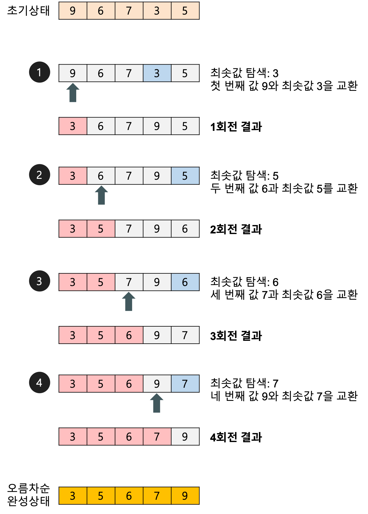

<h1 align="center">Sorting algorithm</h1>
<p align="center">

- <u>**_데이터를 특정한 기준에 따라 순서대로 나열하는 것_**</u>

<br>
<br>


## 선택정렬 (Selection sort)

- 처리되지 않은 데이터 중에서 가장 작은 데이터를 **_선택_** 해 맨 앞에 있는 데이터와 바꾸는 것을 반복
- *N*번 만큼 가장 작은 수를 찾아서 맨 앞으로 보냄
- 구현 방식에 따라 사소한 오차는 있을 수 있지만, 전체 연산 횟수는 다음과 같다.
    - *N + (N-1) + (N-2) + ... + 2*
- 이는 *(N\*\*2+N-2)/2*로 표현, -> **_O(N\*\*2)_**

| Best | Average | Worst | Memory | Stable | Method     |
| ---- | ------- | ----- | ----------------- | ------ | ---------- |
|   |    |  | 1 (In-place)      | **No**    | Selection |

<br>

- 선택 정렬 예시

</img>

```python
>>> array = [9, 6, 7, 3, 5]
>>> selection_sort(array)
step 1 [3, 6, 7, 9, 5]
step 2 [3, 5, 7, 9, 6]
step 3 [3, 5, 6, 9, 7]
step 4 [3, 5, 6, 7, 9]
```

<br>
<br>

## 삽입정렬 (Insertion sort)

- 처리되지 않은 데이터를 하나씩 골라 적절한 위치에 **_삽입_**
- 선택 정렬 비해 구현 난이도가 높은 편이지만, 일반적으로 더 효율적으로 동작
- 시간 복잡도는 **_O(N\*\*2)_** 이며, 선택 정렬과 마찬가지로 반복문이 두 번 중첩
- 현재 리스트의 데이터가 거의 정렬되어 있는 상태라면 매우 빠르게 동작
    - 최선의 경우 *O(N)* 의 시간 복잡도

| Best | Average | Worst | Memory | Stable | Method     |
| ---- | ------- | ----- | ----------------- | ------ | ---------- |
| <i>n</i> |    |  | 1 (In-place)      | Yes    | Insertion |

<br>

- 삽입 정렬 예시

</img>

```python
>>> array = [8, 5, 6, 2, 4]
>>> insertion_sort(array)
step 1 [5, 8, 6, 2, 4]
step 2 [5, 6, 8, 2, 4]
step 3 [2, 5, 6, 8, 4]
step 4 [2, 4, 5, 6, 8]
```


<br>
<br>

## 퀵 정렬 (Quick sort)

- **_기준 데이터_** 를 설정하고 그 기준보다 큰 데이터와 작은 데이터의 위치를 바꾸는 정렬
- 일반적인 상황에서 가장 많이 사용며 분할 정복(divide and conquer) 알고리즘의 하나
- 병합 정렬과 더불어 대부분의 프로그래밍 언어의 정렬 라이브러리의 근간
    - 병합정렬은 균등 분할, 퀵 정렬은 비균등 분할
- **가장 기본적인 퀵 정렬은 첫 번째 데이터를 기준 데이터(Pivot)**로 설정
- 이상적인 경우 분할이 절반씩 일어난다면 전체 연산 횟수로 O(nlogN)를 기대
- 평균 **_O(NlogN)_** 의 시간 복잡도, 최악의 경우 *O(N\*\*2)* 의 시간 복잡도

<br>

- 퀵 정렬 알고리즘의 구체적인 개념 (분할 정복)
    - 하나의 리스트를 피벗(pivot)을 기준으로 두 개의 비균등한 크기로 분할하고 분할된 부분 리스트를 정렬한 다음, 두 개의 정렬된 부분 리스트를 합하여 전체가 정렬된 리스트가 되게 하는 방법
        - **분할(Divide)** : 입력 배열을 피벗을 기준으로 비균등하게 2개의 부분 배열(피벗을 중심으로 왼쪽: 피벗보다 작은 요소들, 오른쪽: 피벗보다 큰 요소들)로 분할
        - **정복(Conquer)** : 부분 배열을 정렬. 부분 배열의 크기가 충분히 작지 않으면 순환 호출 을 이용하여 다시 분할 정복 방법을 적용
        - **결합(Combine)** : 정렬된 부분 배열들을 하나의 배열에 합병
        - 순환 호출이 한번 진행될 때마다 최소한 하나의 원소(피벗)는 최종적으로 위치가 정해지므로, 이 알고리즘은 반드시 끝난다는 것을 보장

</img>

| Best | Average | Worst | Memory | Stable | Method     |
| ---- | ------- | ----- | ----------------- | ------ | ---------- |
|  |    |  |  (worst case: <i>n</i>)      | **No** | Partitioning |

<br>

- 퀵 정렬 예시

</img>

```python
>>> array = [5, 3, 8, 4 ,9, 1, 6, 2, 7]
>>> quick_sort(array,0,len(array)-1)
[1, 2, 3, 4, 5, 6, 7, 8, 9]
```


